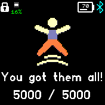

# Step Goal

This app will alert you when you haven't gotten enough steps for the hour to help you reach your step goal and will congratulate you when you reach your step goal.

## Usage

1. Install the app.
2. Set the app settings to your liking.
3. Watch it bug you when you don't get enough steps.
4. Go for a walk.
5. Get congratulated when you reach your step goal for the day.

## Settings

| Name | Description |
| ---- | ----------- |
| Reminder Start Hour    | This is the hour to start sending alerts |
| Reminder Stop Hour     | The hour step reminders will last appear |
| Step Goal Notification | Wether you want to get an alert when you hit your step goal |
| Step Goal Reminder     | Whether you want to get notified when you didn't get enough steps to hit your goal |
| Minute To Get Reminder | What minute of the hour do you want to receive your step reminders |

## Features

Reminds you when you haven't gotten enough steps for the hour.
Congratulates you when you reached your step goal for the day.

## Credits
Icons: [Icons8](https://icons8.com)

JS Minifier: [Minify-js](https://minify-js.com)

## Requests

Features/Bug requests can be submitted on my fork. Fork [Issues](https://github.com/Sleuth56/BangleApps/issues) page.

## Creator

Stephan Burns
